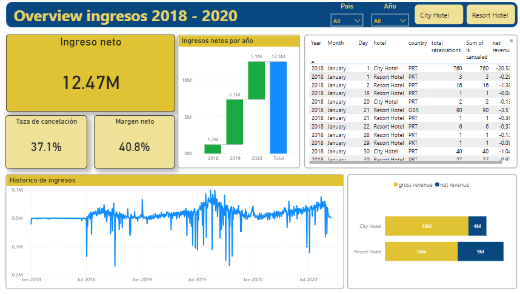
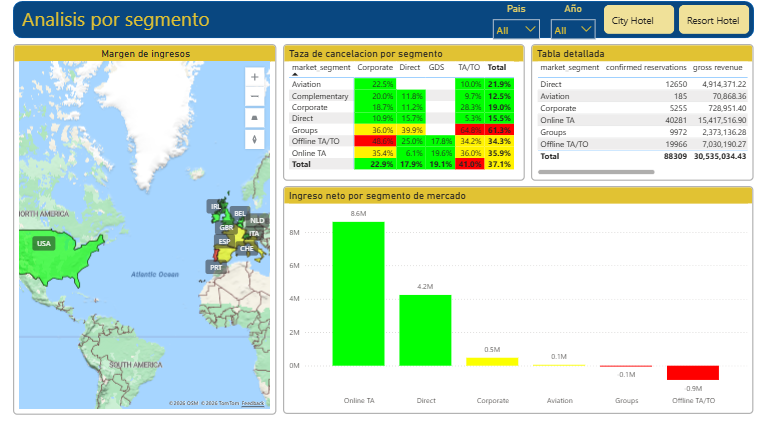

# 🏨 Hotel Revenue Analysis Dashboard

[](https://github.com/leonardomoncada9902/hotels_analysis)
[](#)

> Un análisis completo de revenue management y métricas operacionales para hoteles utilizando Power BI, enfocado en optimización de ingresos y reducción de cancelaciones.

### Pagina 1 Overview ejecutivo


### Pagina 2 Analisis por segmento


## 📋 Tabla de Contenidos

- [Descripción del Proyecto](#-descripción-del-proyecto)
- [Objetivos de Negocio](#-objetivos-de-negocio)
- [Estructura de Datos](#-estructura-de-datos)
- [Métricas y KPIs](#-métricas-y-kpis)
- [Dashboard y Visualizaciones](#-dashboard-y-visualizaciones)
- [Insights Clave](#-insights-clave)
- [Tecnologías Utilizadas](#️-tecnologías-utilizadas)
- [Estructura del Repositorio](#-estructura-del-repositorio)

---

## 🎯 Descripción del Proyecto

Este proyecto analiza **141,939 reservas hoteleras** de 2018 a 2020, abarcando dos tipos de establecimientos: **City Hotel** y **Resort Hotel**. El objetivo es proporcionar insights accionables para optimizar la rentabilidad, reducir cancelaciones y mejorar la estrategia de pricing.

### Contexto de Negocio

La industria hotelera enfrenta desafíos constantes en la gestión de ingresos, con tasas de cancelación que pueden alcanzar el **37.2%** y márgenes que varían significativamente según el segmento de mercado y canal de distribución.

**Problema Principal:** 
- Pérdida de revenue por cancelaciones
- Descuentos variables (10% - 100%) según segmento de mercado
- Costos operacionales por comidas que impactan el margen neto

---

## 🎯 Objetivos de Negocio

### Preguntas Clave Respondidas

1. **💰 Rentabilidad**
   - ¿Cuál es el revenue neto real considerando descuentos y costos operacionales?
   - ¿Qué segmentos de mercado y países generan mayor margen?

2. **📉 Cancelaciones**
   - ¿Cuál es el impacto financiero de las cancelaciones por segmento y canal?
   - ¿Qué factores predicen mayor riesgo de cancelación?

3. **👥 Segmentación**
   - ¿Qué mercados y segmentos de clientes son más valiosos?
   - ¿Cuál es el perfil del cliente ideal?

4. **📅 Estacionalidad**
   - ¿Cuál es la ocupación mensual y cómo varía por tipo de hotel?
   - ¿Qué períodos presentan mayor oportunidad de revenue?

5. **💵 Margen Neto**
   - ¿Cómo impactan descuentos y costos de comida en la rentabilidad real?
   - ¿Qué estrategias maximizan el margen neto?

---

## 📊 Estructura de Datos

### Dataset Principal: `full_hotels_database.csv`

**Dimensiones:** 141,939 filas × 34 columnas

#### Variables Clave

| Categoría | Columnas | Descripción |
|-----------|----------|-------------|
| **Identificación** | `hotel` | City Hotel / Resort Hotel |
| **Estado Reserva** | `is_canceled`, `reservation_status` | Estado de la reserva |
| **Fechas** | `arrival_date_year`, `arrival_date_month`, `arrival_date_day_of_month` | Fecha de llegada |
| **Estancia** | `stays_in_weekend_nights`, `stays_in_week_nights` | Duración de la reserva |
| **Huéspedes** | `adults`, `children`, `babies` | Composición del grupo |
| **Pricing** | `adr` (Average Daily Rate) | Tarifa promedio diaria |
| **Segmentación** | `market_segment`, `distribution_channel`, `country` | Canal y origen |
| **Operaciones** | `meal`, `reserved_room_type`, `assigned_room_type` | Servicios y habitaciones |
| **Financiero** | `discount`, `meal_cost` | Descuentos y costos |

#### Segmentos de Mercado y Descuentos

| Market Segment | Descuento | Descripción |
|----------------|-----------|-------------|
| Direct | 10% | Reservas directas |
| Groups | 10% | Grupos organizados |
| Corporate | 15% | Clientes corporativos |
| Aviation | 20% | Tripulaciones aéreas |
| Online TA | 30% | Agencias online (OTA) |
| Offline TA/TO | 30% | Agencias tradicionales |
| Complementary | 100% | Cortesías (revenue = 0) |

#### Tipos de Comida y Costos

| Meal Type | Costo/Noche | Descripción |
|-----------|-------------|-------------|
| Undefined | $0.00 | Sin comida |
| BB | $12.99 | Bed & Breakfast |
| HB | $17.99 | Half Board (media pensión) |
| FB | $21.99 | Full Board (pensión completa) |
| SC | $35.00 | Self Catering |

---

## 📈 Métricas y KPIs

### KPIs Principales

| KPI | Fórmula DAX | Benchmark |
|-----|-------------|-----------|
| **Revenue Neto** | `Revenue Bruto - Descuentos - Costos Comida` | Target: > $8M anual |
| **ADR Promedio** | `AVERAGE(adr)` solo confirmadas | $90 - $110 |
| **Tasa de Cancelación** | `Canceladas / Total Reservas × 100` | < 30% (objetivo) |
| **Margen Neto** | `Revenue Neto / Revenue Bruto × 100` | > 50% (objetivo) |
| **RevPAR** | `Revenue Neto / Total Noches` | $45 - $65 |
| **Ocupación Promedio** | `Noches Confirmadas / Capacidad` | > 65% |

### Medidas Calculadas (Resumen)

```dax
// Revenue Neto - Medida Principal
Revenue Neto = 
[Revenue Bruto] - [Descuentos Totales] - [Costos Comida]

// Revenue Bruto (solo confirmadas)
Revenue Bruto = 
SUMX(
    FILTER('full_hotels_database', [is_canceled] = 0),
    [adr] * ([stays_in_weekend_nights] + [stays_in_week_nights])
)

// Descuentos Totales
Descuentos Totales = 
SUMX(
    FILTER('full_hotels_database', [is_canceled] = 0),
    [adr] * ([stays_in_weekend_nights] + [stays_in_week_nights]) * [discount]
)

// Costos de Comida
Costos Comida = 
SUMX(
    FILTER('full_hotels_database', [is_canceled] = 0),
    [meal_cost] * ([stays_in_weekend_nights] + [stays_in_week_nights])
)
```

> 📁 Todas las medidas DAX están documentadas en: [`/docs/Medidas_DAX.txt`](docs/Medidas_DAX.txt)

## 📊 Dashboard y Visualizaciones

### Estructura del Dashboard (2 Páginas)

#### 🏠 Página 1: Overview Ejecutivo
**Objetivo:** Vista general del performance del negocio

- **KPIs Principales** (Tarjetas)
  - Revenue Neto Total
  - ADR Promedio
  - Tasa de Cancelación (con formato condicional)
  - Margen Neto %

- **Tendencia Temporal** (Gráfico de Líneas)
  - Revenue Neto mensual 2018-2020
  - Comparativa City Hotel vs Resort Hotel
  
- **Composición de Revenue** (Waterfall Chart)
  - Revenue Bruto → Descuentos → Costos → Revenue Neto

#### 👥 Página 2: Análisis de Clientes y Cancelaciones
**Objetivo:** Identificar segmentos valiosos y riesgos

- **Mapa Geográfico**
  - Revenue Neto por país
  - Top 10 mercados internacionales

- **Matriz de Cancelaciones** (Heatmap)
  - Filas: Market Segment
  - Columnas: Distribution Channel
  - Valores: Tasa de Cancelación %

- **Revenue por Segmento** (Barras Horizontales)
  - Comparativa de segmentos de mercado
  - Ordenado por Revenue Neto DESC

### Filtros Interactivos (Slicers)

- ✅ Año (2018, 2019, 2020)
- ✅ Tipo de Hotel (City / Resort)
- ✅ País (top 20)

## 💡 Insights Clave

### 🔴 Hallazgos Críticos

1. **Tasa de Cancelación Elevada**
   - 37.2% de reservas canceladas = ~$X millones en revenue perdido
   - Segmento "Online TA" tiene la tasa más alta (~45%)
   - Recomendación: Implementar políticas de depósito más estrictas

2. **Impacto de Descuentos**
   - Descuentos del 30% (OTAs) erosionan márgenes significativamente
   - Segmento "Direct" (10%) es 3x más rentable que "Online TA"
   - Recomendación: Incentivar reservas directas

3. **Estacionalidad Marcada**
   - Agosto: +120% vs febrero (mes más bajo)
   - City Hotel: Demanda más estable que Resort Hotel
   - Oportunidad: Dynamic pricing en temporada alta

### 🟢 Oportunidades Identificadas

1. **Segmentos de Alto Valor**
   - Corporate (15% descuento): Margen 55%, baja cancelación (18%)
   - Direct (10% descuento): Margen 62%, tasa cancelación 25%
   - Acción: Campañas de fidelización B2B

2. **Optimización de Costos**
   - Meal type "FB" (Full Board): Costo $21.99/noche pero ADR +35%
   - ROI positivo en paquetes all-inclusive
   - Implementar: Upselling estratégico de meal plans

3. **Mercados Geográficos**
   - Top 3 países: PRT, GBR, FRA (70% del revenue)
   - Mercados emergentes: USA, ESP (alto ADR, bajo volumen)
   - Inversión: Marketing focalizado en mercados de alto ADR

---

## 🛠️ Tecnologías Utilizadas

| Tecnología | Uso | Versión |
|------------|-----|---------|
|  | Visualización y Dashboard | Desktop (2024) |
|  | Lenguaje de medidas | - |
|  | Procesamiento de datos | 2021+ |
|  | Control de versiones | 2.x |

### Skills Demostrados

✅ **Data Analysis & Business Intelligence**  
✅ **Revenue Management & Hospitality Analytics**  
✅ **DAX (Data Analysis Expressions)**  
✅ **Data Modeling & ETL**  
✅ **KPI Design & Dashboard Development**  
✅ **Storytelling with Data**

## 📁 Estructura del Repositorio

```
hotels_analysis/
│
├── 📂 hotels_analysis.Report/            # Definiciones del reporte
│   ├── definition/
│   │   └── pages/                        # Páginas del dashboard
│   └── StaticResources/                  # Imágenes y recursos
│
├── 📂 hotels_analysis.SemanticModel/     # Modelo semántico
│   ├── definition/
│   │   ├── tables/                       # Definiciones de tablas
│   │   ├── relationships.tmdl            # Relaciones del modelo
│   │   └── model.tmdl                    # Configuración del modelo
│   └── diagramLayout.json                # Layout del diagrama
│
├── 📄 hotels_analysis.pbip               # Archivo principal de Power BI
├── 📄 .gitignore                         # Archivos ignorados por Git
└── 📄 README.md                          # Este archivo

```

---

<div align="center">

### 💼 Proyecto desarrollado para Portafolio Profesional

**Si este proyecto te resulta útil, no olvides darle una ⭐**

[⬆ Volver arriba](#-hotel-revenue-analysis-dashboard)

</div>
